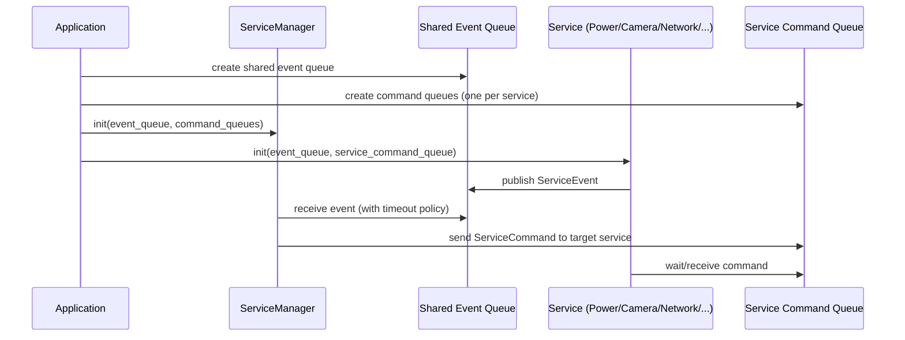

# ESP32 Camera Solutions

ESP32 firmware project using ESP-IDF with a queue-driven service architecture.

## Release Status

- Latest tag: `v0.1.0-alpha`
- Next planned release: `v0.2.0-alpha`

## Top-Level System View

The design is intentionally service-oriented and scalable.

Core building blocks:

1. Application layer
- Creates and owns shared IPC resources (queues).
- Starts core orchestration and service tasks.

2. Service Manager
- Central orchestrator for event consumption and command dispatch.
- Applies system policies such as idle-time deep sleep.

3. Service components (N)
- Each service owns its task logic.
- Each service publishes events to the shared event queue.
- Each service consumes commands from its own command queue.

Scalability model:

1. Add a new service (camera, network, flash LED, etc.).
2. Assign a new `ComponentId` and command queue entry.
3. Register/init it from Application with queue pointers.
4. Keep orchestration policy centralized in Service Manager.

## Runtime Sequence (Scalable)

This is the generic runtime model regardless of how many services exist.



## Current Architecture

The current runtime flow is:

1. Application creates shared queues in [main/Application.cpp](main/Application.cpp).
2. Application initializes ServiceManager, PowerService, CameraService, and StorageService with queue pointers.
3. PowerService reports startup wakeup/reset reason as an event.
4. ServiceManager consumes shared events and dispatches commands by source component and policy.
5. Wakeup-trigger events can produce CaptureFrame commands to CameraService.
6. CameraService captures a frame and posts a frame-ready event with payload pointer.
7. ServiceManager forwards StoreCapture command to StorageService.
8. StorageService writes capture to SD card, then reports StorageWriteDone or StorageError.
9. ServiceManager sends ReleaseCaptureFrame back to CameraService.
10. If ServiceManager receives no events for a configured idle timeout, it sends EnterSleep to PowerService.
11. PowerService configures wakeup sources and enters deep sleep.

## Components

### Service Manager

Files:

- [components/service_manager/include/service_manager.h](components/service_manager/include/service_manager.h)
- [components/service_manager/src/service_manager.cpp](components/service_manager/src/service_manager.cpp)
- [components/service_manager/Kconfig](components/service_manager/Kconfig)

Responsibilities:

- Owns service orchestration task.
- Waits for events from shared event queue.
- Sends commands to component command queues.
- Triggers deep-sleep command after idle timeout.
- Routes events using event source (`EventOrigin`) mapped to component ids.

Config:

- SERVICE_MANAGER_IDLE_TIMEOUT_MS

Meaning:

- Greater than 0: timeout in milliseconds before sending EnterSleep.
- 0: wait forever for events (no idle-triggered sleep).

### Power Service

Files:

- [components/power_service/include/power_service.h](components/power_service/include/power_service.h)
- [components/power_service/src/power_service.cpp](components/power_service/src/power_service.cpp)
- [components/power_service/Kconfig](components/power_service/Kconfig)

Responsibilities:

- Owns power task.
- Detects startup reason:
- wakeup cause after deep sleep, or
- reset reason on normal boot/reset.
- Posts detected reason to shared event queue.
- Waits for EnterSleep command.
- Configures wakeup sources and enters deep sleep.

Config:

- POWER_SERVICE_WAKEUP_GPIO
- POWER_SERVICE_WAKEUP_EDGE_HIGH / POWER_SERVICE_WAKEUP_EDGE_LOW
- POWER_SERVICE_RTC_FALLBACK_TIMEOUT_S

Wakeup behavior:

- External GPIO wakeup through ext0 with configured level.
- RTC timer fallback wakeup if timeout is greater than 0.

## Queues

Queues are created in [main/Application.cpp](main/Application.cpp):

- Event queue: shared queue for service events.
- Command queues: one queue per component id.

Queue message types are defined in [components/service_manager/include/service_manager.h](components/service_manager/include/service_manager.h):

- ServiceEvent
- ServiceCommand
- ServiceEventId
- ServiceCommandId

Current queue contract:

- `ServiceEvent` carries `origin`, `event_id`, and `data_ptr`.
- `EventOrigin` is aligned with component identifiers (`PowerService`, `CameraService`, `StorageService`, plus `Hardware` for extensibility).
- `ServiceCommand` carries `command_id` and `data_ptr` only.
- Service-specific command payloads are passed through `data_ptr` as typed structures (for example `CaptureFramePayload`).

## Component Dependencies

Build-time dependencies are declared in each component CMake file:

- [components/service_manager/CMakeLists.txt](components/service_manager/CMakeLists.txt): no extra `REQUIRES`
- [components/power_service/CMakeLists.txt](components/power_service/CMakeLists.txt): `REQUIRES service_manager`, `PRIV_REQUIRES esp_driver_gpio`
- [components/camera_service/CMakeLists.txt](components/camera_service/CMakeLists.txt): `REQUIRES service_manager esp32-camera`, `PRIV_REQUIRES esp_psram`
- [components/storage_service/CMakeLists.txt](components/storage_service/CMakeLists.txt): `REQUIRES service_manager fatfs sdmmc esp_timer`

Managed component dependency:

- [components/camera_service/idf_component.yml](components/camera_service/idf_component.yml): `espressif/esp32-camera`

## Build, Flash, Monitor

1. Source ESP-IDF environment:

```bash
. /path/to/esp-idf/export.sh
```

2. Configure options:

```bash
idf.py menuconfig
```

3. Build:

```bash
idf.py build
```

4. Flash and monitor:

```bash
idf.py flash monitor
```

## GitHub CLI Build Flow

This repository includes a CI workflow at [.github/workflows/build.yml](.github/workflows/build.yml) that builds with ESP-IDF in GitHub Actions and uploads binaries as artifacts.

1. Authenticate GitHub CLI:

```bash
gh auth login
```

2. Trigger a manual build workflow:

```bash
gh workflow run build.yml --ref main
```

3. List recent workflow runs:

```bash
gh run list --workflow build.yml --limit 5
```

4. Watch latest run live:

```bash
gh run watch
```

5. Download artifacts from a completed run:

```bash
gh run download <run-id> --dir artifacts
```

6. View logs for a run if build fails:

```bash
gh run view <run-id> --log
```

## Release Process (v0.2.0-alpha)

This repository publishes a GitHub Release automatically when a tag matching `v*` is pushed (see [.github/workflows/build.yml](.github/workflows/build.yml)).

1. Ensure working tree is clean and tests/build pass:

```bash
git status --short
idf.py build
```

2. Create and push the release tag:

```bash
git tag -a v0.2.0-alpha -m "Second alpha release"
git push origin v0.2.0-alpha
```

3. Monitor the release workflow:

```bash
gh run list --workflow build.yml --limit 5
gh run watch
```

4. Confirm release assets are attached:

- `esp32-camera-solutions.bin`
- `esp32-camera-solutions.elf`
- `bootloader.bin`
- `partition-table.bin`
- `flasher_args.json`

## Project Layout

```text
.
|-- main/
|   |-- app_main.cpp
|   |-- Application.h
|   |-- Application.cpp
|   `-- CMakeLists.txt
|-- components/
|   |-- camera_service/
|   |   |-- include/
|   |   |   `-- camera_service.h
|   |   |-- src/
|   |   |   `-- camera_service.cpp
|   |   |-- CMakeLists.txt
|   |   `-- idf_component.yml
|   |-- storage_service/
|   |   |-- include/
|   |   |   `-- storage_service.h
|   |   |-- src/
|   |   |   `-- storage_service.cpp
|   |   `-- CMakeLists.txt
|   |-- service_manager/
|   |   |-- include/
|   |   |   `-- service_manager.h
|   |   |-- src/
|   |   |   `-- service_manager.cpp
|   |   |-- CMakeLists.txt
|   |   `-- Kconfig
|   `-- power_service/
|       |-- include/
|       |   `-- power_service.h
|       |-- src/
|       |   `-- power_service.cpp
|       |-- CMakeLists.txt
|       `-- Kconfig
|-- CMakeLists.txt
|-- Kconfig
|-- sdkconfig.defaults
`-- README.md
```
