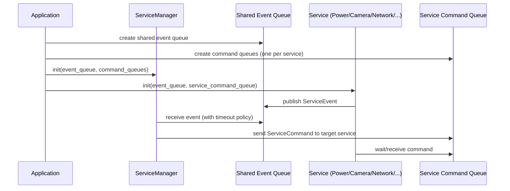

# ESP32 Camera Solutions

ESP32 firmware project using ESP-IDF with a queue-driven service architecture.

## Top-Level System View

The design is intentionally service-oriented and scalable.

Core building blocks:

1. Application layer
- Creates and owns shared IPC resources (queues).
- Starts core orchestration and service tasks.

2. Service Manager
- Central orchestrator for event consumption and command dispatch.
- Applies system policies such as idle-time deep sleep.

3. Service components (N)
- Each service owns its task logic.
- Each service publishes events to the shared event queue.
- Each service consumes commands from its own command queue.

Scalability model:

1. Add a new service (camera, network, flash LED, etc.).
2. Assign a new `ComponentId` and command queue entry.
3. Register/init it from Application with queue pointers.
4. Keep orchestration policy centralized in Service Manager.

## Runtime Sequence (Scalable)

This is the generic runtime model regardless of how many services exist.



## Current Architecture

The current runtime flow is:

1. Application creates shared queues in [main/Application.cpp](main/Application.cpp).
2. Application initializes ServiceManager and PowerService with queue pointers.
3. PowerService starts a FreeRTOS task and reports startup power reason as an event.
4. ServiceManager starts a FreeRTOS task and consumes events.
5. If ServiceManager receives no events for a configured idle timeout, it sends an EnterSleep command to PowerService.
6. PowerService receives EnterSleep, configures wakeup sources, then enters deep sleep.

## Components

### Service Manager

Files:

- [components/service_manager/include/service_manager.h](components/service_manager/include/service_manager.h)
- [components/service_manager/src/service_manager.cpp](components/service_manager/src/service_manager.cpp)
- [components/service_manager/Kconfig](components/service_manager/Kconfig)

Responsibilities:

- Owns service orchestration task.
- Waits for events from shared event queue.
- Sends commands to component command queues.
- Triggers deep-sleep command after idle timeout.

Config:

- SERVICE_MANAGER_IDLE_TIMEOUT_MS

Meaning:

- Greater than 0: timeout in milliseconds before sending EnterSleep.
- 0: wait forever for events (no idle-triggered sleep).

### Power Service

Files:

- [components/power_service/include/power_service.h](components/power_service/include/power_service.h)
- [components/power_service/src/power_service.cpp](components/power_service/src/power_service.cpp)
- [components/power_service/Kconfig](components/power_service/Kconfig)

Responsibilities:

- Owns power task.
- Detects startup reason:
- wakeup cause after deep sleep, or
- reset reason on normal boot/reset.
- Posts detected reason to shared event queue.
- Waits for EnterSleep command.
- Configures wakeup sources and enters deep sleep.

Config:

- POWER_SERVICE_WAKEUP_GPIO
- POWER_SERVICE_WAKEUP_EDGE_HIGH / POWER_SERVICE_WAKEUP_EDGE_LOW
- POWER_SERVICE_RTC_FALLBACK_TIMEOUT_S

Wakeup behavior:

- External GPIO wakeup through ext0 with configured level.
- RTC timer fallback wakeup if timeout is greater than 0.

## Queues

Queues are created in [main/Application.cpp](main/Application.cpp):

- Event queue: shared queue for service events.
- Command queues: one queue per component id.

Queue message types are defined in [components/service_manager/include/service_manager.h](components/service_manager/include/service_manager.h):

- ServiceEvent
- ServiceCommand
- ServiceEventId
- ServiceCommandId

## Build, Flash, Monitor

1. Source ESP-IDF environment:

```bash
. /path/to/esp-idf/export.sh
```

2. Configure options:

```bash
idf.py menuconfig
```

3. Build:

```bash
idf.py build
```

4. Flash and monitor:

```bash
idf.py flash monitor
```

## GitHub CLI Build Flow

This repository includes a CI workflow at [.github/workflows/build.yml](.github/workflows/build.yml) that builds with ESP-IDF in GitHub Actions and uploads binaries as artifacts.

1. Authenticate GitHub CLI:

```bash
gh auth login
```

2. Trigger a manual build workflow:

```bash
gh workflow run build.yml --ref main
```

3. List recent workflow runs:

```bash
gh run list --workflow build.yml --limit 5
```

4. Watch latest run live:

```bash
gh run watch
```

5. Download artifacts from a completed run:

```bash
gh run download <run-id> --dir artifacts
```

6. View logs for a run if build fails:

```bash
gh run view <run-id> --log
```

## Project Layout

```text
.
|-- main/
|   |-- app_main.cpp
|   |-- Application.h
|   |-- Application.cpp
|   `-- CMakeLists.txt
|-- components/
|   |-- service_manager/
|   |   |-- include/
|   |   |   `-- service_manager.h
|   |   |-- src/
|   |   |   `-- service_manager.cpp
|   |   |-- CMakeLists.txt
|   |   `-- Kconfig
|   `-- power_service/
|       |-- include/
|       |   `-- power_service.h
|       |-- src/
|       |   `-- power_service.cpp
|       |-- CMakeLists.txt
|       `-- Kconfig
|-- CMakeLists.txt
|-- Kconfig
|-- sdkconfig.defaults
`-- README.md
```
